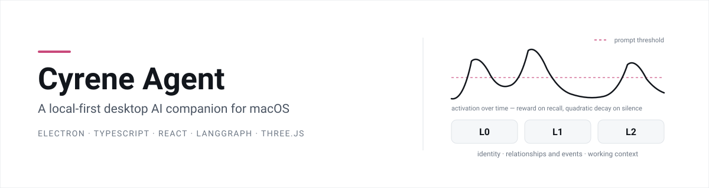
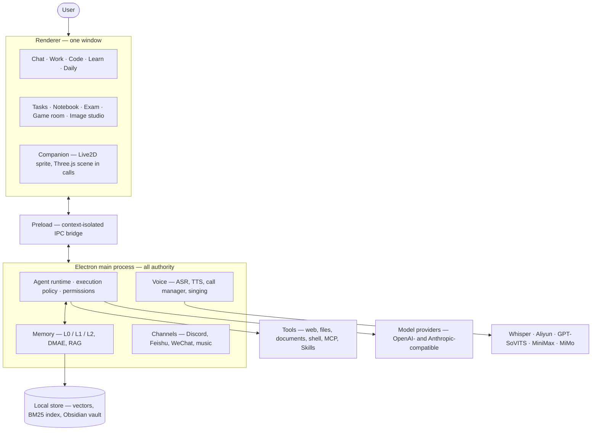
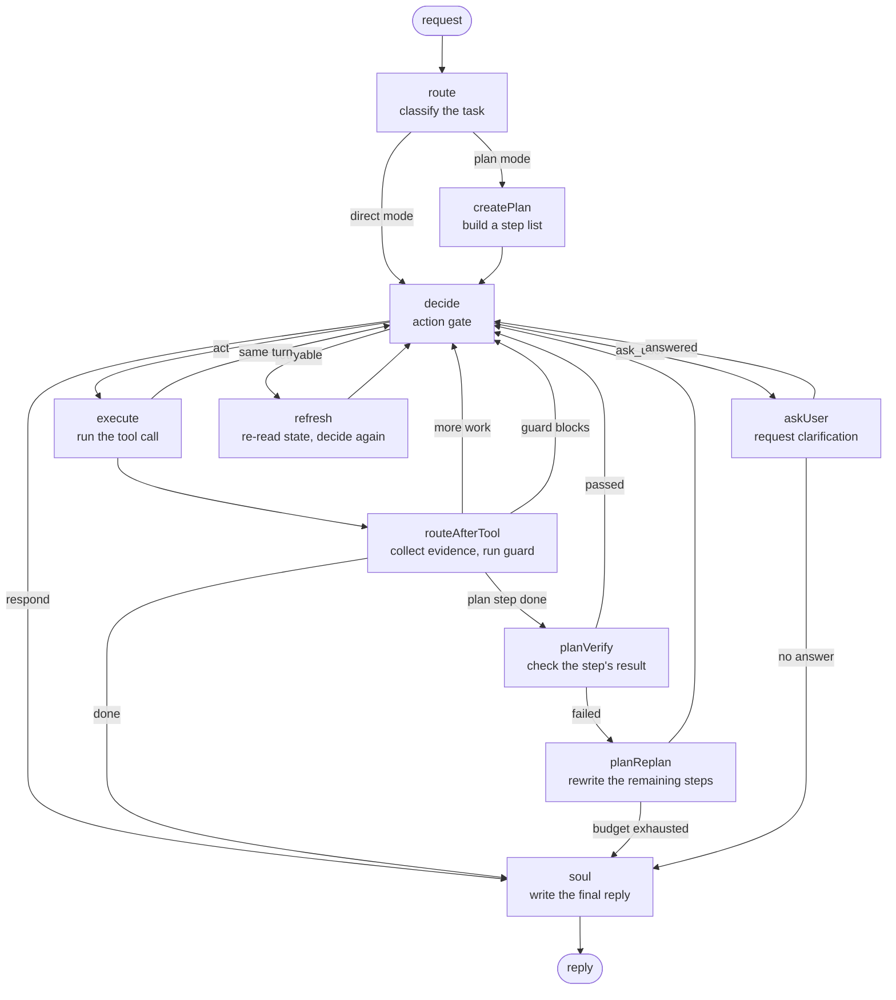
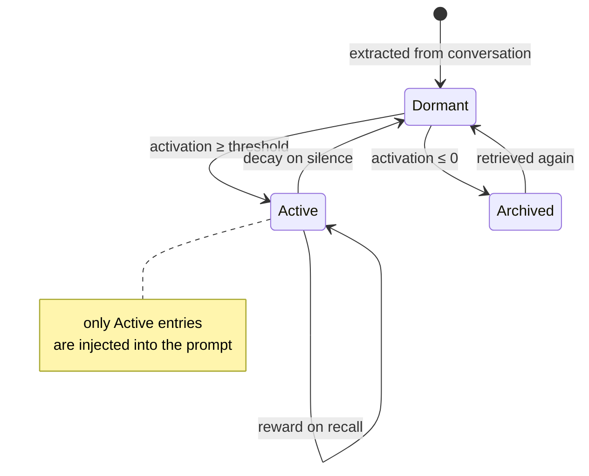
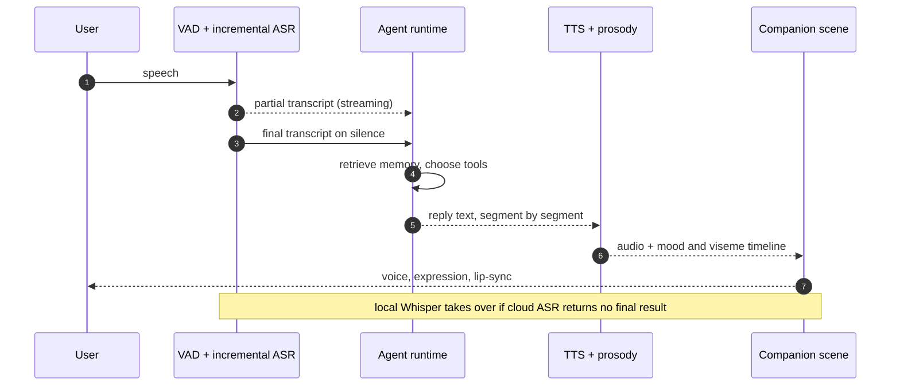

# Cyrene Agent

<picture>
  <source media="(prefers-color-scheme: dark)" srcset="./docs/figures/banner-dark.svg">
  
</picture>

Cyrene Agent is a desktop application that keeps a single AI companion resident on
your Mac. It holds a conversation, remembers what mattered across months of those
conversations, executes real tools on your machine, talks and listens in real time,
and renders an animated character while it does all of it. Everything except the
language model itself runs on the local machine.

I maintain this fork. The sections below describe how the system is built, which
parts of it I wrote, and how to verify both claims from the repository itself.

**Contents** —
[What it does](#what-it-does) ·
[What I built](#what-i-built) ·
[Architecture](#architecture) ·
[The agent runtime](#the-agent-runtime) ·
[Memory](#memory-the-dmae-activation-model) ·
[Voice](#voice-and-the-call-loop) ·
[Running it](#running-it) ·
[Testing](#testing) ·
[Privacy](#privacy-and-security) ·
[Attribution](#attribution-and-licensing)

> [!NOTE]
> This is a fork of [Playa-0v0/Cyrene-Agent](https://github.com/Playa-0v0/Cyrene-Agent),
> an unofficial fan project with no affiliation to HoYoverse. The character design and
> related assets belong to their respective owners; see
> [Attribution and licensing](#attribution-and-licensing).

## What it does

The application opens as one window. Five modes share that window rather than
splitting into separate apps, because the thing that makes a companion useful is
continuity — the same memory and the same personality behind every mode.

| Mode | What it is for |
| --- | --- |
| **Chat** | Ordinary conversation, drawing on recent context and long-term memory |
| **Work** | Tool-using tasks with a visible plan, approval gates, and verified results |
| **Code** | Editing and running code inside directories you have explicitly trusted |
| **Learn** | Study support backed by an Obsidian vault — notes, exercises, review |
| **Daily** | Short questions, reminders, and everyday lookups |

Alongside the conversation the app runs a companion panel (a Live2D sprite, or a
full 3D scene during calls), a notebook, an exam generator, a game room, an image
studio, and optional bridges to Discord, Feishu, WeChat, Spotify, and MCP servers.

## What I built

Upstream's history and mine are interleaved in one git history, so a plain commit
count is a poor description of who wrote what. Two measures, both reproducible:

| Measure | This fork | Upstream and others |
| --- | ---: | ---: |
| Commits reachable from `HEAD` | 66 of 1,300 — **5.1%** | 1,234 — 94.9% |
| Lines surviving in `src/` | 103,702 of 232,928 — **44.5%** | 129,226 — 55.5% |
| Divergence from upstream `master` | 337 commits ahead · 1,090 files · +235,219 / −19,664 | — |

They disagree by nearly an order of magnitude, and the reason is commit granularity
rather than effort: upstream committed in small increments over ten weeks, while my
work landed as a smaller number of subsystem-sized commits. Blame share describes
the code that runs today; commit count describes how often each of us typed
`git commit`. Both are here so that neither gets read alone. The exact commands are
in [`docs/attribution.md`](./docs/attribution.md); figures recomputed 2026-08-26.

The subsystems I am responsible for:

- **The agent runtime** — the graph in [`src/main/orchestrator/`](./src/main/orchestrator/)
  that owns a run from request to reply: scheduling, tool dispatch, streaming,
  context compaction, retry and error classification, run recovery, bounded tool
  output, and the finalization guard described [below](#the-agent-runtime).
- **Memory** — the L2 layer and the DMAE activation model that decides which
  memories are live enough to enter a prompt, plus the reflection worker and the
  hybrid reranker.
- **Voice** — incremental local Whisper transcription, the Aliyun engine,
  emotion-aware prosody, per-turn latency tracing, and the singing pipeline with
  lyric-timeline lip-sync.
- **The 3D companion** — a PMX/VMD scene on Three.js with Bullet rigid-body
  physics, procedural gestures, arm IK, and depth of field.
- **macOS continuity** — a stable application identity and `userData` path so that
  memory, diaries, chats, channel links, and model settings survive upgrades, with
  non-destructive migration that keeps recovery copies before touching legacy data.
- **The unified workspace** — chat, settings, and tasks consolidated into one
  window, with synchronized dark and light themes.
- **Developer subsystems** — an LSP client, a git service, an MCP server, and
  execution tracing.
- **Upstream integration** — two reconciliation merges (2026-07-27 and 2026-08-11)
  that resolved upstream against local features, repaired tests broken by
  incomplete upstream work, and restored build scripts dropped from `package.json`.

## Architecture

The renderer holds no privileged capability of its own. Every model call, tool
invocation, memory read, and file access crosses a context-isolated preload bridge
into the main process, which is where all authority lives.



**Figure 1.** Process boundaries and the direction of authority.

## The agent runtime

A Work-mode request is not a single model call. It runs as a state graph
(`src/main/orchestrator/agent-graph.ts`) that can plan, act, re-plan, ask a
question, or give up, and returns to a decision node after every tool call.



**Figure 2.** The Work-mode execution graph, as wired in `agent-graph.ts`.

The part worth pointing at is `routeAfterTool` and the **finalization guard**. An
agent that edits files will otherwise happily announce success it never checked. So
once a tool mutates a file, the run records the revision it produced, and the guard
decides whether the run has earned the right to finish. Missing evidence blocks the
route to `soul` and forces a verification run as the next action. Verification that
ran and failed lets the reply through, but marked as failed rather than dressed up
as success. Finishing honestly is a structural property of the graph rather than
something the model is asked nicely to do.

## Memory: the DMAE activation model

Memory is stored in three layers — **L0** for stable identity, **L1** for
relationships and events, **L2** for working context extracted from conversation.
Retrieval is hybrid: vector search and BM25, with optional reranking, and every
retrieved passage keeps a reference back to the record it came from so it can be
inspected or deleted.

The interesting problem is not storage but *selection*. A companion that has talked
to you for months has far more memories than fit in a prompt, and recency alone is
a bad filter. Each entry therefore carries an **activation** score that rises when
the memory gets used and decays while it goes unused
(`src/main/rag/worldbook.ts`):

```text
reward (user recall)   Ru = Bu · (1 + γ·ln(1 + U)) · (1 − A/Amax)^p · 1/(1 + ρ·n)
reward (model recall)  Rm = Bm · e^(−λ·U)
decay                  D  = (α·US² + β·MS²) / √I
```

`U`/`US` is how long the user has gone without touching the memory, `MS` the same
for the model, `A` current activation, `I` the entry's intrinsic value, and `n` how
often it fired in the recent window. The shapes are deliberate. Decay is quadratic,
so forgetting accelerates rather than trickling. Resistance divides by `√I`, so a
valuable memory is forgotten *more slowly* but never gains a faster climb — which
stops high-value entries from permanently squatting at the top of the prompt. And
the saturation gate `(1 − A/Amax)^p` means an already-hot memory gains little from
being hit again.



**Figure 3.** Activation states. The threshold is what a memory must clear to be
spent on prompt budget at all.

## Voice and the call loop

A call is a latency problem before it is anything else. Speech recognition runs
incrementally so that transcription is already in progress while you are still
talking, and text-to-speech is segmented so the first sentence can begin playing
before the model has finished the paragraph. Whisper runs locally and takes over
whenever a cloud recogniser fails to return a final result.



**Figure 4.** One conversational turn during a call. Every hop after the first
partial transcript is streamed, which is what keeps the turn feeling like a
conversation instead of a request.

## Running it

Requirements: Node.js 24 LTS, npm 10 or newer, macOS 13 or later, and an API key
for a supported model provider.

```bash
git clone https://github.com/clark970417-eng/Cyrene-Agent-Mac.git
cd Cyrene-Agent-Mac
npm ci
npm run build
npm start
```

For development with hot reload:

```bash
npm run dev
```

Then open **Settings** and configure, in roughly this order: the model provider
(key, endpoint, model, optional vision model), the tool permission level, memory
and RAG (embedding model, reranker, optional Obsidian vault), voice (TTS engine and
reference audio, ASR), and any optional channels. Settings live under Electron's
`userData` directory and apply without a restart.

On macOS that directory is `~/Library/Application Support/live2d-cyrene`, for both
source and Dock launches. It is deliberately not renamed: it is the compatibility
anchor for existing memory, chats, diaries, Discord state, and usage history.

Windows and Linux still build from source — Windows needs a Rust screenshot helper
(`npm run build:screenshot-helper`) that macOS does not, since macOS uses the system
`screencapture` utility. Native automation and some channel connectors remain
platform-specific.

## Testing

```bash
npm test
```

Last full run on this branch, 2026-08-26:

| | |
| --- | --- |
| Test files | 400 passed, 2 skipped (402) |
| Tests | 3,270 passed, 13 skipped (3,283) |
| Duration | 56.7 s |

The suite covers the agent graph and its guard conditions, memory extraction and
the DMAE scoring, RAG retrieval, ASR normalisation and fallback, channel adapters,
and the settings and migration paths — the places where a silent regression would
cost real user data.

## Privacy and security

The application is local-first, but it is not hermetic: a configured model provider
receives what you send it, and each optional integration receives what it needs to
do its job.

- Memory is inspectable and deletable per layer and per entry.
- Credentials use the OS credential vault through Electron `safeStorage` — Keychain
  on macOS, DPAPI on Windows, libsecret on Linux — with plaintext legacy values
  still readable so nobody gets locked out mid-migration.
- Exported `.cydiag` diagnostic bundles redact keys, tokens, and passwords, and the
  activity log bounds and redacts tool arguments rather than dumping them.
- Agent file access is gated by a level you choose — `read-only`, `scoped`,
  `per-action`, or `full` — persisted across restarts and defaulting to read-only.
- Never commit or share the `userData` directory. It contains everything.

Treat MCP servers, Skills, model endpoints, and trusted code directories the way
you would treat anything else you grant execution rights to.

## Attribution and licensing

This repository is a fork of [Playa-0v0/Cyrene-Agent](https://github.com/Playa-0v0/Cyrene-Agent),
which is itself an unofficial fan project. Code is MIT licensed
([LICENSE](./LICENSE)); model and character assets are governed separately by
[MODEL_LICENSE.md](./MODEL_LICENSE.md). Character names, designs, and related game
assets are the property of their respective owners and are not covered by the MIT
grant.

A full accounting of which commits and which lines came from where, with the
commands to reproduce it, is in [`docs/attribution.md`](./docs/attribution.md).

Third-party components integrated here:

- [WutheringWavesUID](https://github.com/tyql688/WutheringWavesUID) — game ecosystem tooling
- [cloud-music-mcp](https://github.com/Code-MonkeyZhang/cloud-music-mcp) — music integration

Figures in this README were drawn for this repository.
