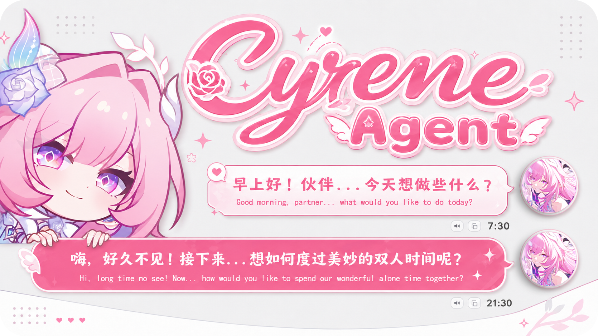
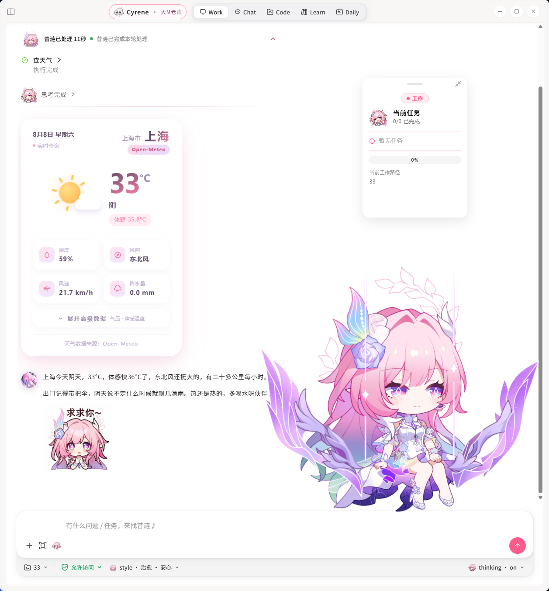
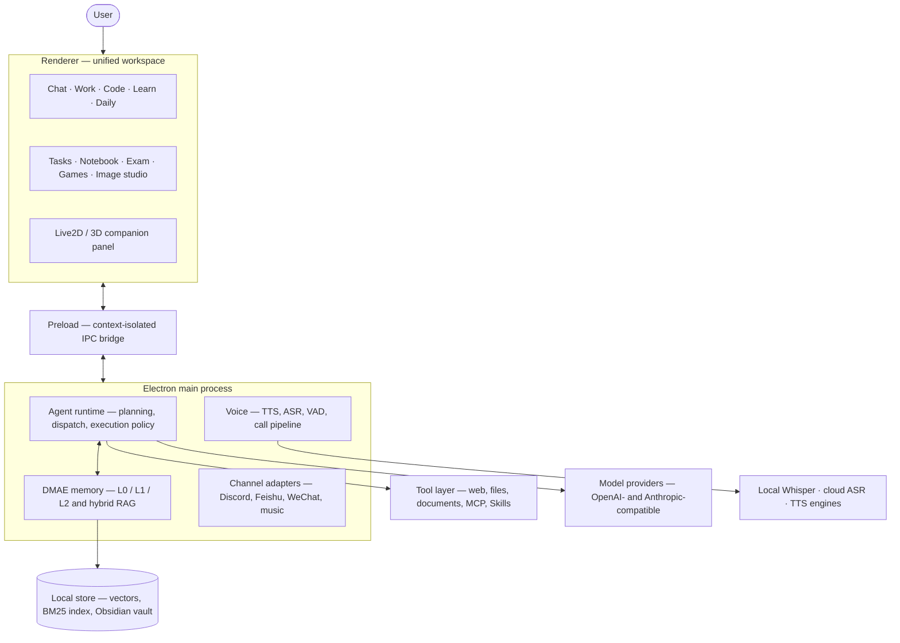
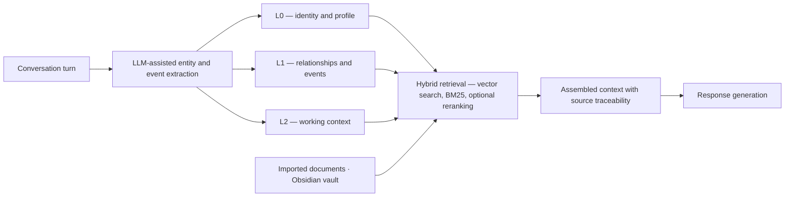
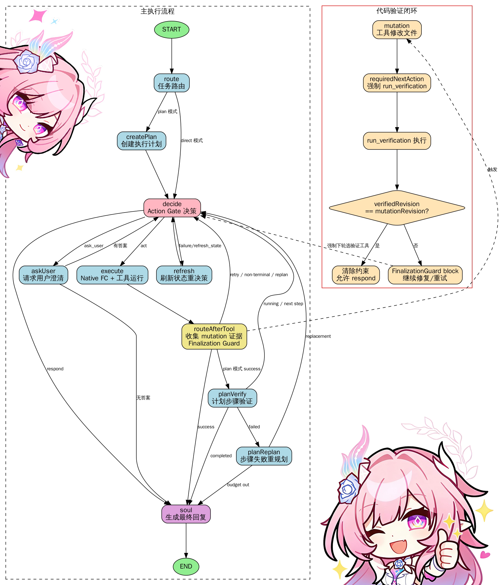

# Cyrene Agent

<div align="center">



**A local-first, memory-aware AI desktop companion inspired by Cyrene.**

Built with Electron, TypeScript, React, Live2D, and an extensible agent runtime.

[Scope and Authorship](#scope-and-authorship) · [Features](#features) · [Architecture](#architecture) · [Quick Start](#quick-start) · [Configuration](#configuration) · [Development](#development) · [Safety](#security-and-privacy)

</div>

> [!NOTE]
> This repository is a community-maintained fork of [Playa-0v0/Cyrene-Agent](https://github.com/Playa-0v0/Cyrene-Agent). It is an unofficial fan project and is not affiliated with HoYoverse.

## Scope and Authorship

Upstream work and the work added in this fork share a single git history, so the
figures below record what was authored here and how each one can be reproduced.
The full method, including the exact commands, is documented in
[`docs/attribution.md`](./docs/attribution.md). Figures recomputed 2026-08-23.

| Measure | This fork | Upstream and other contributors |
| --- | ---: | ---: |
| Commits reachable from `HEAD` | 66 of 1,300 — **5.1%** | 1,234 — 94.9% |
| Lines surviving in `src/` | 103,702 of 232,928 — **44.5%** | 129,226 — 55.5% |
| Divergence from upstream `master` | 337 commits ahead · 1,090 files changed · +235,219 / −19,664 lines | — |

The two measures disagree by close to an order of magnitude. The upstream lineage
committed in small increments over ten weeks, whereas the work in this fork landed
as a smaller number of subsystem-sized commits. Blame share describes the code that
executes today; commit count describes how often each author committed. Both are
reported so that neither is read in isolation.

### Subsystems implemented in this fork

| Subsystem | Work performed |
| --- | --- |
| **Upstream integration** | Two reconciliation merges (2026-07-27 and 2026-08-11) resolving upstream changes against local features, repairing tests broken by incomplete upstream work in progress, and restoring npm scripts and development dependencies that had been dropped from `package.json` |
| **macOS continuity** | A stable application identity and `userData` path so that memory, diaries, chat history, channel links, and model settings survive upgrades; non-destructive startup migration with recovery copies; application packaging and signing |
| **Unified workspace and theming** | Chat, settings, and tasks consolidated into a single window; synchronized dark and light theme systems; hardcoded colour values routed through theme tokens |
| **Agent core** | The runtime that owns an agent run end to end — scheduling, tool dispatch, response streaming, context compaction, retry and error classification, run recovery, bounded tool output, and side-effect guards |
| **3D companion** | A PMX/VMD scene on Three.js with Bullet rigid-body physics, a procedural gesture system, arm inverse kinematics, and song lip-synchronisation |
| **Voice** | Incremental local Whisper transcription, Aliyun speech recognition, emotion-aware prosody, per-turn latency tracing, and the singing pipeline |
| **Developer subsystems** | Language Server Protocol client, git service, MCP server, and execution tracing |

## Overview

Cyrene Agent combines character-driven conversation, persistent memory, voice interaction, tool execution, learning support, coding assistance, games, and optional messaging integrations in one desktop application.

The desktop experience uses a unified workspace: chat, tasks, settings, the notebook, study tools, games, Wuthering Waves utilities, and image creation stay inside one window, while the companion panel keeps Cyrene visible. A synchronized **Cyrene Night** and **Pearl Light** theme system applies across the workspace and embedded tools.

The agent supports five focused modes:

| Mode | Purpose |
| --- | --- |
| **Chat** | Character-focused conversation using recent context, user preferences, and long-term memory |
| **Work** | Tool-enabled planning and execution with visible progress, approval gates, and result verification |
| **Code** | Scoped coding assistance for trusted directories, including file edits, commands, and tests |
| **Learn** | Obsidian-assisted study, note organization, exercise generation, and learning progress |
| **Daily** | General questions, information organization, reminders, and lightweight everyday tasks |

## Features

### Companion and conversation

- Live2D desktop companion with expressions, motion, mood, status, speech bubbles, and stickers
- Multi-session chat with conversation history, pinned sessions, and configurable response styling
- Traditional Chinese (Taiwan) localization throughout the desktop interface
- Taiwan-first locale context for local time, weather, holidays, services, and regional information
- Proactive messages with quiet-hour and delivery-target controls
- Unified dark and light themes, custom fonts, corner radius, chat spacing, and companion sizing

### DMAE memory system

- L0, L1, and L2 memory layers for identity, relationships, events, and working context
- DMAE Worldbook for long-term character and relationship continuity
- LLM-assisted entity and event extraction
- Hybrid RAG retrieval with vector search, BM25, optional reranking, and source traceability
- Obsidian Vault binding, manual synchronization, and structured notebook workflows
- User-controlled memory inspection and deletion

### Agent and tool runtime

- Direct and plan-based execution modes
- Structured tool calls with execution policy, permission levels, and repair budgets
- Streaming reasoning, tool state, task plans, and confirmation cards
- Web search, webpage reading, local files, documents, email, maps, weather, music, screenshots, and MCP tools
- Provider profiles for OpenAI-compatible, Anthropic-compatible, and custom model endpoints
- Configurable timeout, iteration, retry, context-window, and multimodal settings

### Voice

- Text-to-speech through MiniMax, MiMo, GPT-SoVITS, Mossland, or a custom cloud endpoint
- Streaming playback and automatic reading
- Natural vocal enhancement for pauses, breathing, laughter, and conversational cadence
- Real-time speech recognition, voice calls, VAD silence detection, and push-to-talk
- Offline Whisper transcription with automatic fallback when cloud ASR does not return a final result
- Optional bounded screen sharing during calls; Cyrene invokes vision only when the user refers to visible content
- Local reference-audio selection for supported voice engines

### Built-in workspaces

- Shared notebook with categories, search, page navigation, and editable entries
- Exam mode for generated quizzes, explanations, scoring, and review
- Game room with relationship quizzes, board games, memory games, story choices, and Ropebound
- Wuthering Waves tools with local macOS Vision OCR support
- Image studio with prompt building, reference images, character consistency, and multiple providers
- Discord Activity lobby for the Ropebound cooperative experience

### Optional integrations

- Discord bot and Activity support
- Feishu / Lark and WeChat iLink messaging
- Spotify and NetEase Cloud Music controls
- Optional Google Cloud bot runtime with a desktop failover dashboard, editable macOS SSH connection settings, live Gateway/watchdog/heartbeat status, and manual local/cloud handoff controls
- MCP servers over stdio, SSE, and HTTP
- User-defined Skills and reusable tool instructions
- X account and AniList airing notifications with per-account routing controls

### Continuity, diagnostics, and recovery

- A stable macOS application identity and `userData` path preserve existing memory, diaries, chats, mobile/channel links, Discord state, model settings, token history, and call duration history across upgrades
- Startup migration is non-destructive and keeps recovery copies before taking over legacy local data
- L0/L1/L2 memory inspection includes search, pinning, and user-controlled deletion
- Agent activity records show tool status, duration, and bounded redacted arguments without exposing credentials
- Exportable `.cydiag` diagnostic bundles redact API keys, tokens, passwords, and secrets
- Portable backups preserve current-device credentials instead of replacing them with empty backup values
- AniList access tokens and supported integration credentials use the operating system credential vault where available

## Interface

<div align="center">



</div>

**Figure 1.** The unified workspace in Work mode. The transcript records the tool
call and its result inline, the task panel on the right tracks plan progress, and
the companion view remains visible alongside the conversation.

## Architecture

### System overview



**Figure 2.** Process and layer boundaries. The renderer holds no privileged
capability of its own: every model call, tool invocation, memory read, and file
access crosses the context-isolated preload bridge into the main process.

### Memory and retrieval pipeline



**Figure 3.** The DMAE memory pipeline. Each layer is separately inspectable and
individually deletable by the user, and retrieved passages retain a reference to
the record they came from.

### Work-mode execution graph

<div align="center">



</div>

**Figure 4.** The Work-mode execution graph. The main loop (left) routes a request
to either direct execution or plan-based execution and returns to the action gate
after every tool call. The verification loop (right) is the guard that makes a
file-modifying run finish honestly: once a tool mutates a file, the next action is
forced to be a verification run, and the finalization guard blocks a final response
until the verified revision matches the mutated revision.

### Component map

```text
Electron Main Process
├── DMAE memory, RAG, relationship, and locale services
├── Agent orchestration, execution policy, tools, and Skills
├── TTS, ASR, media, screenshot, and notification services
├── Optional Discord, Feishu, WeChat, music, and cloud adapters
└── Secure preload bridges
    └── Unified React / HTML workspace
        ├── Chat, Work, Code, Learn, and Daily
        ├── Tasks, settings, notebook, and exam mode
        ├── Game room, Wuthering Waves tools, and image studio
        └── Shared theme, typography, and Traditional Chinese runtime
```

Important directories:

| Path | Description |
| --- | --- |
| `src/main/` | Electron main process, agent runtime, memory, tools, voice, and integrations |
| `src/preload/` | Context-isolated APIs exposed to renderer windows |
| `src/renderer/` | Unified workspace, React chat, settings, companion UI, and embedded tools |
| `src/shared/` | Shared types, IPC channels, normalization, and cross-process contracts |
| `prompts/` | Character, phone, Work, and system prompt layers |
| `skills/` | Built-in agent Skills and reference resources |

## Platform Support

| Platform | Status | Notes |
| --- | :---: | --- |
| **macOS** | ✅ Source build tested | Native screenshot capture uses `/usr/sbin/screencapture`; local Vision OCR is available for supported tools |
| **Windows 10 / 11** | ✅ Supported | Primary upstream platform; includes the Rust screenshot helper and Windows-specific automation |
| **Linux** | 🧪 Experimental | Desktop environment, keyring, transparent-window, and native automation behavior may vary |

Some channel connectors and native automation features remain platform-specific. The core Electron application, memory system, chat, workspace, and most tools are cross-platform.

## Quick Start

### Requirements

- Node.js 24 LTS
- npm 10 or newer
- A supported LLM API key
- macOS 13+ or Windows 10 / 11

Clone this fork and install the locked dependencies:

```bash
git clone https://github.com/clark970417-eng/Cyrene-Agent.git
cd Cyrene-Agent
npm ci
```

Build and start the desktop application:

```bash
npm run build
npm start
```

For active development:

```bash
npm run dev
```

### Windows screenshot helper

Windows source builds require Rust stable and Visual Studio 2022 Build Tools with the C++ desktop workload:

```powershell
npm run build:screenshot-helper
npm run build
npm start
```

The packaged Windows directory build is available through:

```bash
npm run package:win:dir
```

macOS uses the system screenshot utility and does not require the Windows Rust helper.

## Configuration

Open **Settings** in the application and configure:

1. **Model provider** — API key, endpoint, model, transport, and optional vision model.
2. **Appearance** — Cyrene Night or Pearl Light, font, spacing, window radius, and companion behavior.
3. **Memory and RAG** — embedding model, reranker, document imports, and optional Obsidian Vault.
4. **Voice** — TTS engine, voice ID or reference audio, streaming, speed, volume, and optional ASR.
5. **Permissions** — read-only, scoped, per-action, or full tool execution.
6. **Optional channels** — Discord, Feishu, WeChat, Spotify, music, and cloud services.

Most settings are stored under Electron's platform-specific `userData` directory and are applied without restarting the app.

On macOS, source and Dock launches intentionally use `~/Library/Application Support/live2d-cyrene`. Do not rename or manually split this directory: it is the compatibility anchor for earlier memory, chat, Discord, token-usage, call-usage, diary, and mobile-integration data.

## Development

Common commands:

```bash
npm test                    # Run the Vitest suite
npm run build:main          # Compile the Electron main process
npm run build:preload       # Compile context-isolated preload bridges
npm run build:renderer      # Build all renderer entry points
npm run build               # Build Skills, main, preload, CLI, and renderer
npm run dev                 # Start Vite and Electron in development mode
```

The current unified macOS integration was verified with:

- 295 passing test files (plus one intentionally skipped file)
- 2,623 passing tests (plus ten intentionally skipped tests)
- Successful main, preload, and renderer builds
- A source-built macOS Electron launch using the stable legacy-compatible data directory
- Runtime confirmation that the existing Discord gateway identity and saved playlist library reconnect

> [!TIP]
> The active unified macOS implementation is published on the `codex/unified-upstream-integration` branch. The existing `main` history is retained to protect earlier cloud, Discord, WavesUID, and documentation work while the two histories are consolidated safely.

## Security and Privacy

Cyrene Agent is local-first, but external model providers and optional integrations receive the data required to perform their configured tasks.

- Never commit or share the Electron `userData` directory, local settings, tokens, cookies, logs, or private memory files.
- Supported credentials use Electron `safeStorage` where implemented: DPAPI on Windows, Keychain on macOS, and libsecret on Linux. Legacy plaintext values remain readable so users can migrate without losing access.
- Review the selected tool permission level before enabling command execution or external services.
- Use only trusted MCP servers, Skills, model endpoints, and code directories.

This is experimental companion and agent software. Keep backups of important notes and review tool actions before granting broad permissions.

## Project Status

Core desktop conversation, memory, agent execution, voice configuration and fallback, themes, notebook, exam mode, games, notifications, activity diagnostics, backups, and primary tools are implemented. RAG, third-party MCP compatibility, proactive delivery, cloud failover, and some messaging integrations remain experimental and may require additional setup.

Contributions, reproducible bug reports, and platform-specific verification are welcome.

## License and Credits

See [LICENSE](./LICENSE) and [MODEL_LICENSE.md](./MODEL_LICENSE.md) for code and model asset terms.

- Original project: [Playa-0v0/Cyrene-Agent](https://github.com/Playa-0v0/Cyrene-Agent)
- Wuthering Waves ecosystem integration: [WutheringWavesUID](https://github.com/tyql688/WutheringWavesUID)
- Music integration: [cloud-music-mcp](https://github.com/Code-MonkeyZhang/cloud-music-mcp)

Characters, names, and related game assets belong to their respective owners.
